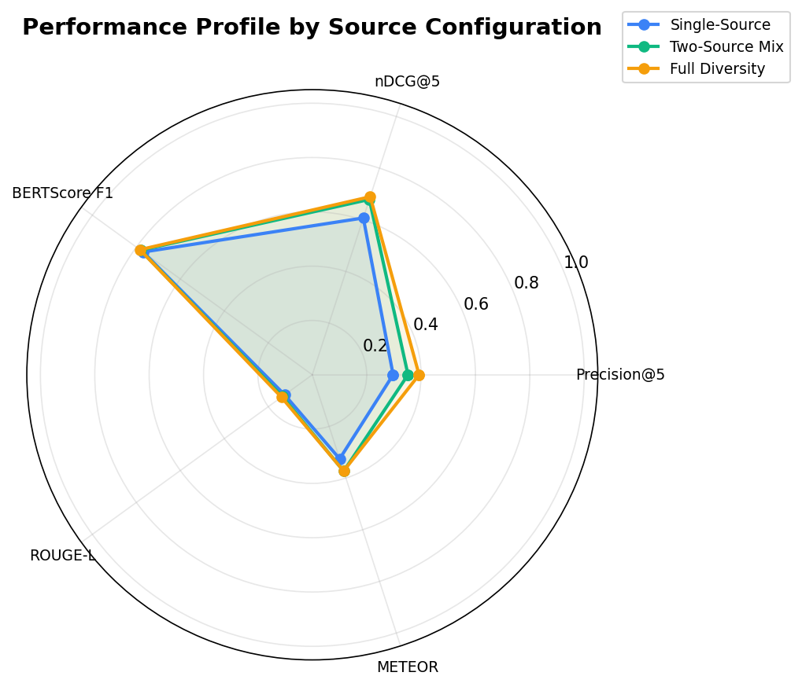
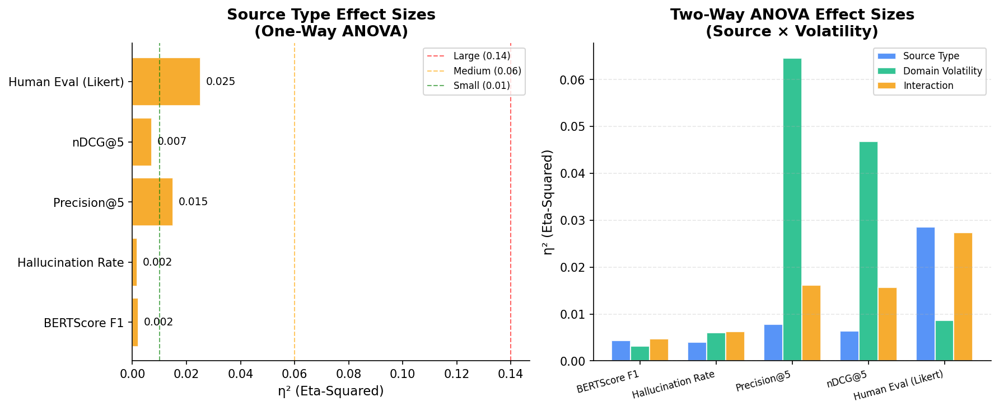

# RAG Performance Framework

A complete research implementation for predicting Retrieval-Augmented Generation (RAG) system performance based on dataset-level factors — **freshness** and **source-type diversity** — across domains with different information volatility.

This repository contains the full experimental pipeline (data collection → RQ1–RQ4 experiments) and a standalone predictive web framework that estimates RAG performance *before deployment*.

---

## Project Overview

| Component | Purpose |
|---|---|
| `dataset_rag_builder/` | Automated data collection pipeline (arXiv, PubMed, News RSS, GDELT, official docs, archives) |
| `rag_dataset/` | Collected and staged documents (10,787 docs across 9 collections, 12 experimental conditions) |
| `rq1_experiment/` | RQ1 & RQ2: RAG experiment across 12 conditions (2,400 queries), metrics, ANOVA, plots |
| `rq2_experiment/` | RQ2: Source-type contribution analysis (runs as part of RQ1 pipeline) |
| `rq3_experiment/` | RQ3: Predictive framework — OLS, Random Forest, XGBoost with 10-fold CV |
| `rq4_experiment/` | RQ4: LOCO validation, 95% CI benchmark ranges, boundary conditions |
| `framework/` | Standalone deployable web app (FastAPI + React 19) — the final deliverable |

---

## Research Design

**12 experimental conditions** crossing freshness levels × source-type configurations × 3 domains:

- **Technology** (high volatility) — C1 to C6
- **Healthcare** (medium volatility) — C7 to C9
- **History** (low volatility) — C10 to C12

All RAG components (embedding model, retrieval, generation, prompt) are held **constant** so that observed differences reflect dataset factors only.

### Key Findings

| Domain | Source Diversity Effect | Recommended Update |
|---|---|---|
| Technology | +94% Precision@5 with full diversity | Weekly |
| Healthcare | −16% Precision@5 (source pollution) | Monthly |
| History | +37% Precision@5 with news sources | Quarterly |

---

## Tech Stack

| Layer | Technology |
|---|---|
| Language | Python 3.13 |
| Embeddings | sentence-transformers/all-MiniLM-L6-v2 (local) |
| Vector Store | FAISS (exact inner-product) |
| Metrics | BERTScore, DeBERTa NLI hallucination, ROUGE-L, METEOR |
| Statistics | scikit-learn, statsmodels, XGBoost |
| Data Collection | requests, BeautifulSoup, Playwright (headless Chromium) |
| Framework Backend | FastAPI + Uvicorn |
| Framework Frontend | React 19 + Vite 6 + Recharts |

---

## Quick Start

### Run the experiments (full reproduction)

```bash
# Setup
python -m venv .venv
.venv\Scripts\activate        # Windows
pip install -r requirements.txt
python -m playwright install chromium

# 1. Collect data
python -m dataset_rag_builder.cli --rq1-query-alignment

# 2. RQ1: Run RAG experiment + analysis
python -m rq1_experiment.run_experiment
python -m rq1_experiment.run_analysis

# 3. RQ3: Train predictive models
python -m rq3_experiment.run_rq3

# 4. RQ4: LOCO validation
python -m rq4_experiment.run_rq4
```

### Run the predictive framework (standalone app)

```bash
cd framework

# Windows
run-windows.bat

# Linux / macOS
chmod +x run-linux.sh && ./run-linux.sh
```

- Backend → http://localhost:8000 (API docs at `/docs`)
- Frontend → http://localhost:3000

---

## Framework Screenshots

| Research Overview | Prediction Tool |
|---|---|
|  |  |

---

## Repository Structure

```
├── dataset_rag_builder/     # Data ingestion pipeline (RAW → CLEANED → FINAL)
│   ├── functions/           # sources.py, processing.py, dataset_builder.py
│   ├── helpers/             # text cleaning utilities
│   └── utils/               # HTTP, IO, model utilities
├── rag_dataset/             # Staged document collections + conditions
├── rq1_experiment/          # Full RAG experiment + evaluation + analysis
│   ├── rag_system/          # embedder, indexer, retriever, generator, pipeline
│   ├── evaluation/          # BERTScore, hallucination, retrieval metrics
│   ├── analysis/            # ANOVA, regression, random forest, plots
│   ├── query_bank/          # Pre-registered query banks
│   └── results/             # Raw outputs, metrics, plots, FAISS indexes
├── rq2_experiment/          # Source-type contribution (uses RQ1 data)
├── rq3_experiment/          # Predictive framework development
│   ├── models/              # OLS, Random Forest, XGBoost, decay curves
│   ├── framework/           # predictor.py (the trained model API)
│   └── results/             # rq3_models.json (trained model)
├── rq4_experiment/          # LOCO validation + boundary conditions
│   ├── validation/          # Bootstrap CI + boundary detection
│   └── results/             # rq4_validation.json
├── framework/               # Standalone deployable web app
│   ├── backend/             # FastAPI (core/predictor, recommender, config)
│   └── frontend/            # React 19 + Vite + Recharts
└── requirements.txt         # Python dependencies
```


---

## Note on Excluded Files

> **This repository does not include the following due to GitHub's 100 MB file size limit:**
>
> - `rag_dataset/` — The full collected dataset (10,787 documents across 9 collections). To regenerate, run:
>   ```bash
>   python -m dataset_rag_builder.cli --rq1-query-alignment
>   ```
> - `rq1_experiment/results/raw_outputs/` — Per-query RAG outputs for all 12 conditions. To regenerate, run:
>   ```bash
>   python -m rq1_experiment.run_experiment
>   ```
> - `rq1_experiment/results/faiss_indexes/` — FAISS vector indexes per condition. Rebuilt automatically during experiment execution.
>
> All other results (metrics, analysis, plots, trained models, validation) are included and the framework app runs standalone without these files.
---

## License

Released for academic and research use.

---

*Master's Dissertation — Akashdeep Singh (24072095)*
*Supervisor: AP Dr. Mumtaz Begum Binti Peer Mustafa*
